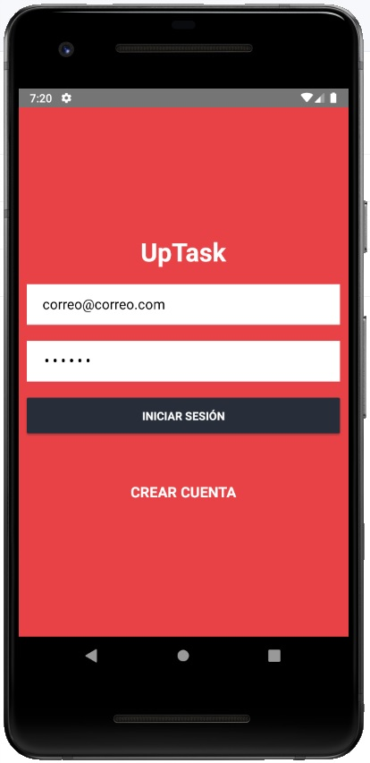

# App Nativa para Gestionar Tareas realizada con React Native y Backend en Apollo Server, GraphQL, JWT y MongoDB

Proyecto completo desarrollado con React. La app se comunica con una api realizada con Apollo Server y GraphQL. Cada usuario puede crear su cuenta y almacenar sus proyectos y tareas en MongoDB. Se utilizó Native Base como framework de diseño para el frontend de la app.

## Herramientas utilizadas:
- React Hooks
- React Native
- React Native Navigation
- Native Base
- MongoDB
- Apollo Server
- JWT

## Pasos a seguir:

- Para comenzar ejecute:
`npm install`

- Para ejecutar la API ejecute:
`upTaskGraphQL/ npm start`

- Para ejecutar la App para Android utilize este comando:
`upTaskNative/ npx react-native run-android`

- Para ejecutar la App para IOS utilize este comando:
`upTaskNative/ npx react-native run-ios`

- En la carpeta firebase (del proyecto restaurantcliente) modifique el archivo: config.js por sus propias credenciales.

## Vista Previa de la App:

